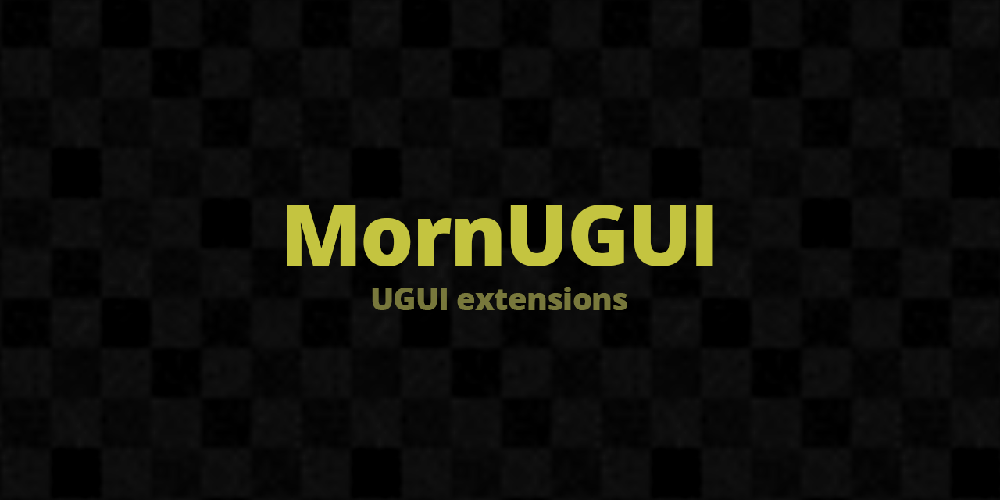

# MornUGUI

<p align="center">
  
</p>

<p align="center">
  
</p>

## 概要

Unity UGUI の拡張フレームワーク。Selectable ベースの Button / Slider / Selector、モジュール式エフェクト (色・音・スケール)、スクロール・ナビゲーション制御を提供する。

## 導入方法

Unity Package Manager で以下の Git URL を追加:

```
https://github.com/TsukumiStudio/MornUGUI.git?path=src#1.1.0
```

`Window > Package Manager > + > Add package from git URL...` に貼り付けてください。

### 依存パッケージ

- [UniRx](https://github.com/neuecc/UniRx) (`com.neuecc.unirx`)
- [UniTask](https://github.com/Cysharp/UniTask) (`com.cysharp.unitask`)
- [TextMeshPro](https://docs.unity3d.com/Packages/com.unity.textmeshpro@latest) (`com.unity.textmeshpro`)
- [Unity InputSystem](https://docs.unity3d.com/Packages/com.unity.inputsystem@latest) (`com.unity.inputsystem`)
- [Arbor](https://arbor.caitsithware.com/) (Arbor 連携用、任意)
- [MornGlobal](https://github.com/TsukumiStudio/MornGlobal) (`com.tsukumistudio.mornglobal`)
- [MornUtil](https://github.com/TsukumiStudio/MornUtil) (`com.tsukumistudio.mornutil`)
- [MornEditor](https://github.com/TsukumiStudio/MornEditor) (`com.tsukumistudio.morneditor`)
- [MornEase](https://github.com/TsukumiStudio/MornEase) (`com.tsukumistudio.mornease`)
- [MornEnum](https://github.com/TsukumiStudio/MornEnum) (`com.tsukumistudio.mornenum`)
- [MornLocalize](https://github.com/TsukumiStudio/MornLocalize) (`com.tsukumistudio.mornlocalize`)
- [MornSound](https://github.com/TsukumiStudio/MornSound) (`com.tsukumistudio.mornsound`)

## ライセンス

[The Unlicense](LICENSE)
